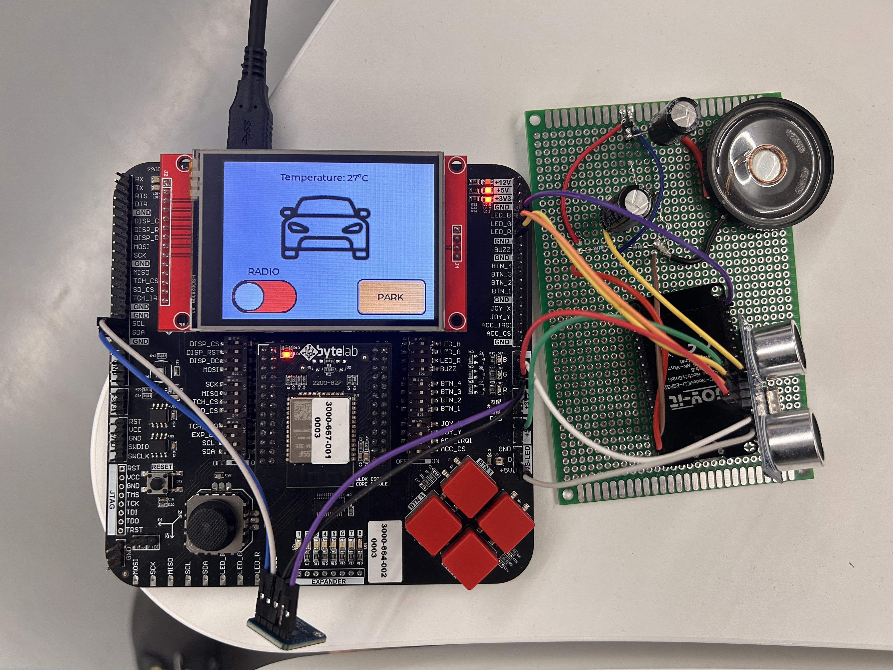
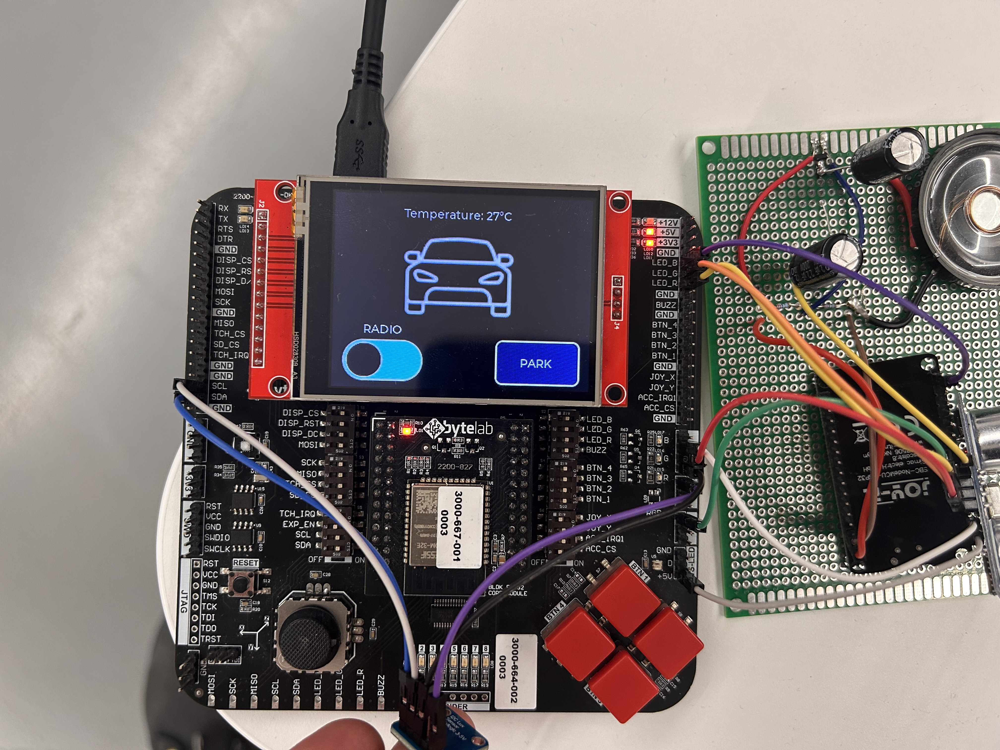
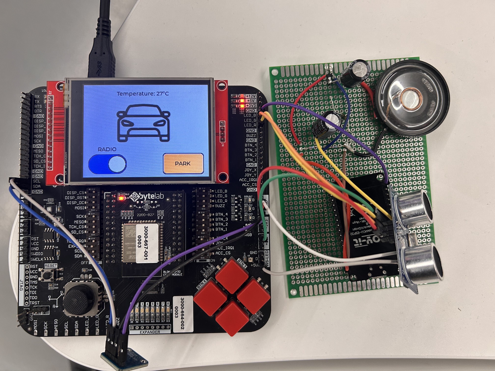
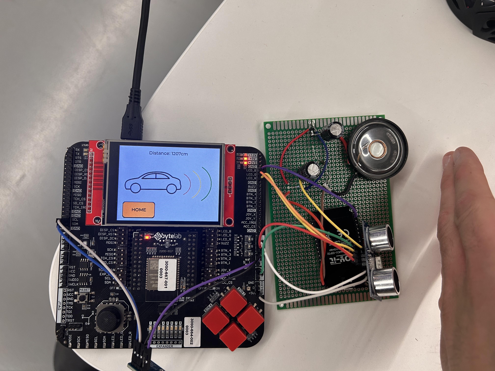

# 🚗 Car Infotainment System – WES Hackathon 2025
**Team Name:** `Dva ERI, Dva RI`  
**Hackathon:** WES Hackathon 2025  
**Team Members:** Alberto Kerim, Borna Krušlin, Niko Šikić, Matko Marjanac

---

## 🏆 Achievement

> **🥈 2nd Place – WES Hackathon 2025**  
> Our team secured **second place** and a **cash prize** out of all competing teams!

---

## 📌 Overview
This project is a **Car Infotainment System** built for ESP32 using **ESP-IDF** and **FreeRTOS**. It integrates sensor readings, a GUI dashboard, and BT capabilities to simulate modern vehicle interfaces. Designed for embedded environments, it provides a scalable and responsive car infotainment experience.

---

## 🚀 Features
- Real-time display of vehicle/environmental data
- Interactive and responsive GUI (built with LVGL)
- I2C sensor communication
- Bluetooth connectivity (For Spotify)
- Hardware abstraction with modular components

---

## 🧠 Architecture
```
ESP32 (FreeRTOS)
├── GUI (LVGL)
├── Sensor Manager (I2C)
├── BT Manager
└── Main Control Loop (app_main.c)
```
- **GUI:** Displays sensor data, status, and UI components
- **Sensor Manager:** Reads data over I2C from connected hardware
- **Bluetooth:** Connects and play data over speaker

---

## 🔧 Tech Stack
- ESP-IDF 5.0.x
- LVGL 8.3.x
- FreeRTOS
- C (Embedded)
- I2C protocol
- TFT LCD + XPT2046 Touch Controller (ILI9341)

---

## 📁 Project Structure
| Path                          | Description                                |
|-------------------------------|--------------------------------------------|
| `main/`                       | Entry point (`app_main.c`) and system init |
| `components/gui/`             | Graphical User Interface code              |
| `components/sensors/`         | Sensor initialization and I2C handling     |
| `src/bt`                      | src for bluetooth code for secondary esp32 |
| `sdkconfig`                   | ESP-IDF configuration                      |
| `Makefile` / `CMakeLists.txt` | Build system setup                         |

---

## 🛠️ Setup & Installation
### Prerequisites
- ByteLab ESP32 board
- ESP-IDF v5.0.x installed
- Python 3.x
- USB connection to board

### Build & Flash
```bash
git clone https://github.com/your-team/WES-main.git
cd src
#In src dir
idf.py fullclean
rm dependencies.lock
idf.py reconfigure
idf.py build
idf.py -p COMX flash  # Update port as needed
idf.py -p COMX monitor
```

---

## 🖼️ Screenshots






---

## 🧪 Demo Use Case
1. Power on ESP32 with attached screen and sensors.
2. System initializes GUI and I2C interface.
3. Sensor data updates are reflected live on-screen.
4. BT module connects and optionally spins songs.

---

## 👨‍💻 Team Contributions
| Member            | Role                        |
|-------------------|-----------------------------|
| **Alberto Kerim** | Sensor integration, I2C     |
| **Borna Krušlin** | GUI development (LVGL)      |
| **Niko Šikić**    | Bluetooth system            |
| **Matko Marjanac**| Main architecture, FreeRTOS |

---

## 📄 License
This project is developed for educational and non-commercial purposes as part of the WES Hackathon 2025.
